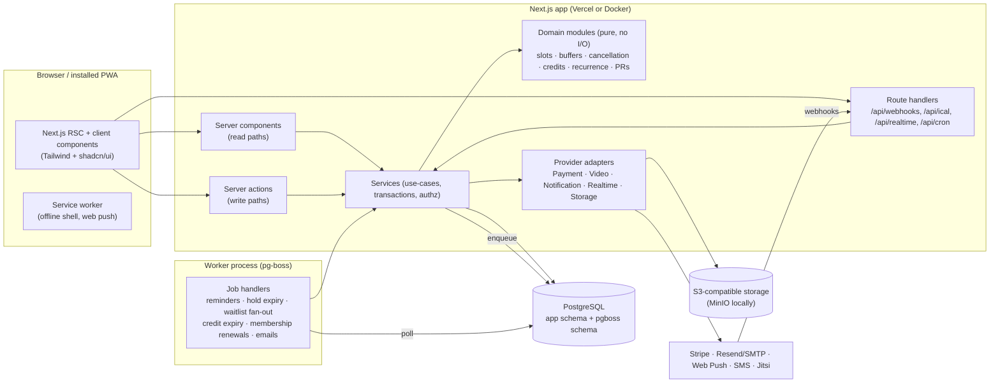
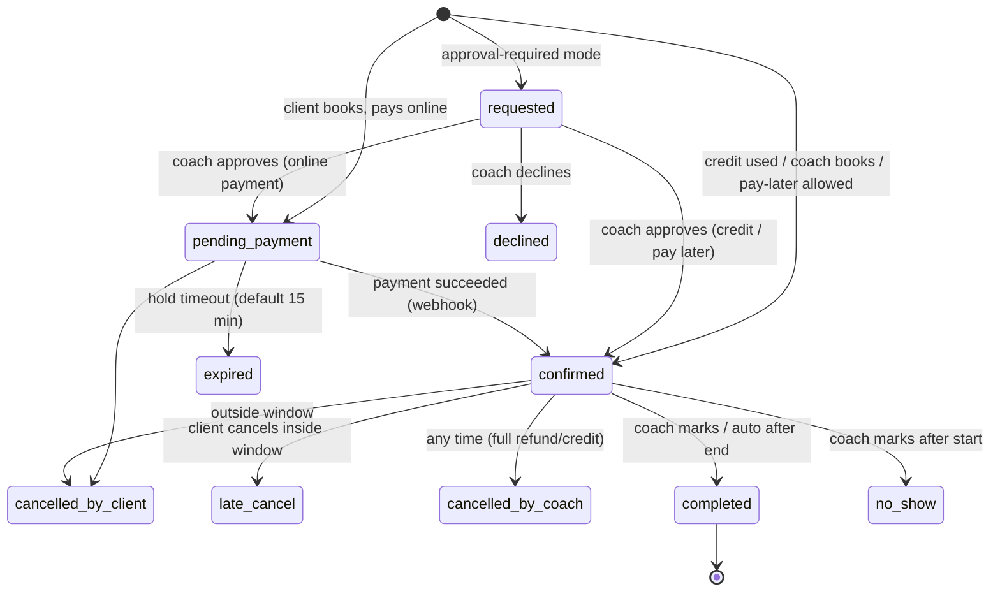
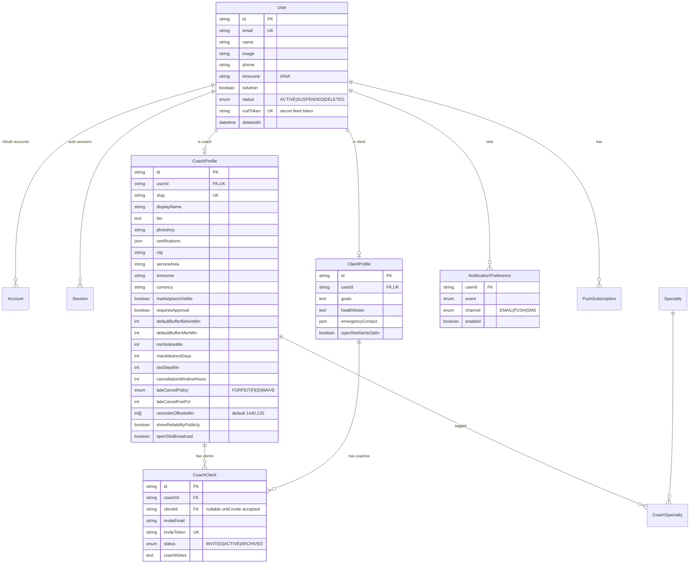
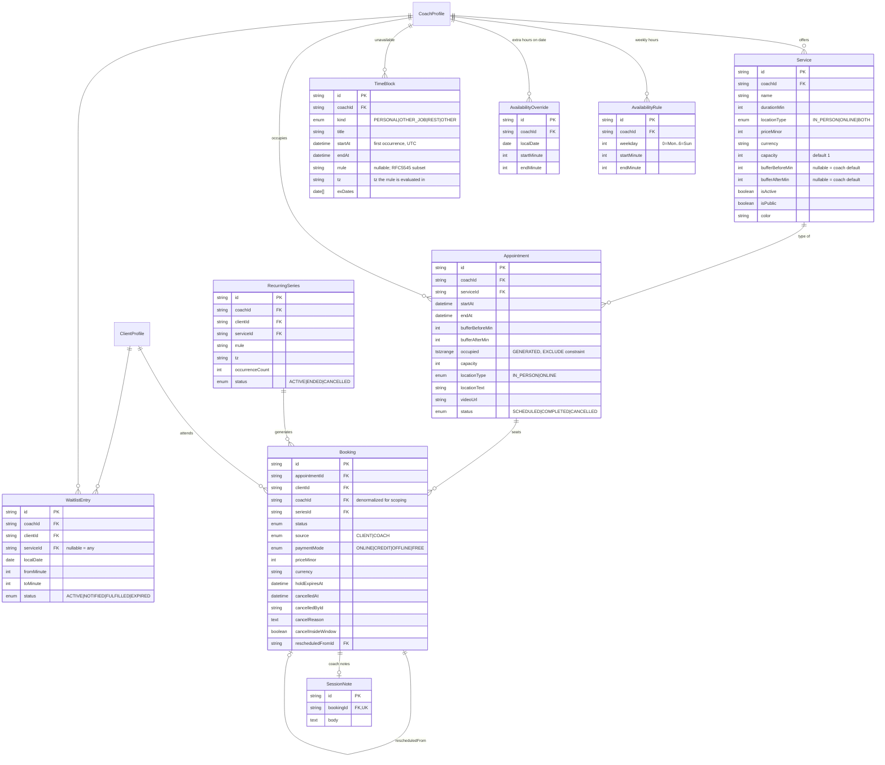
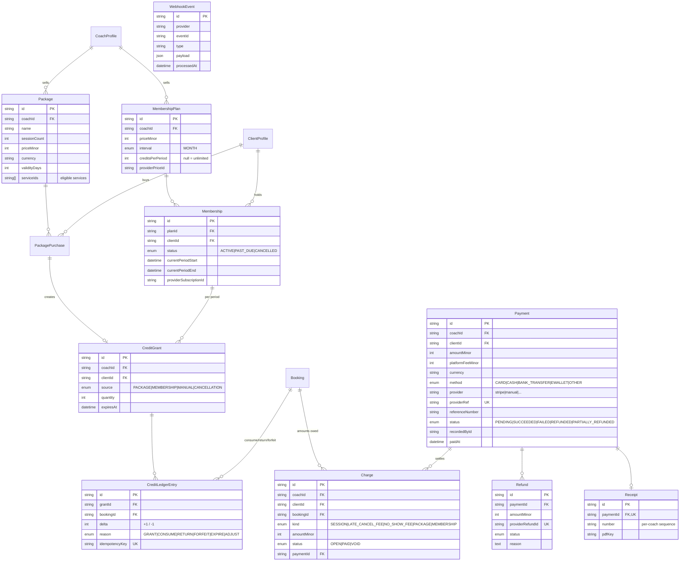
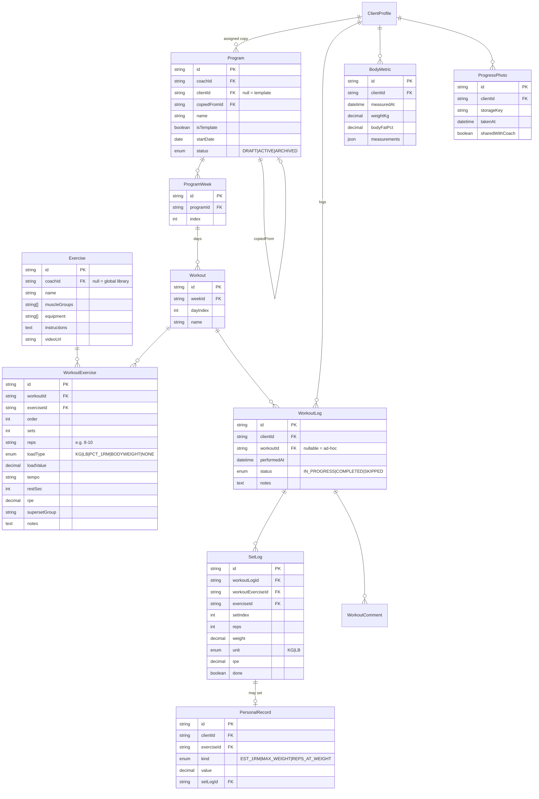
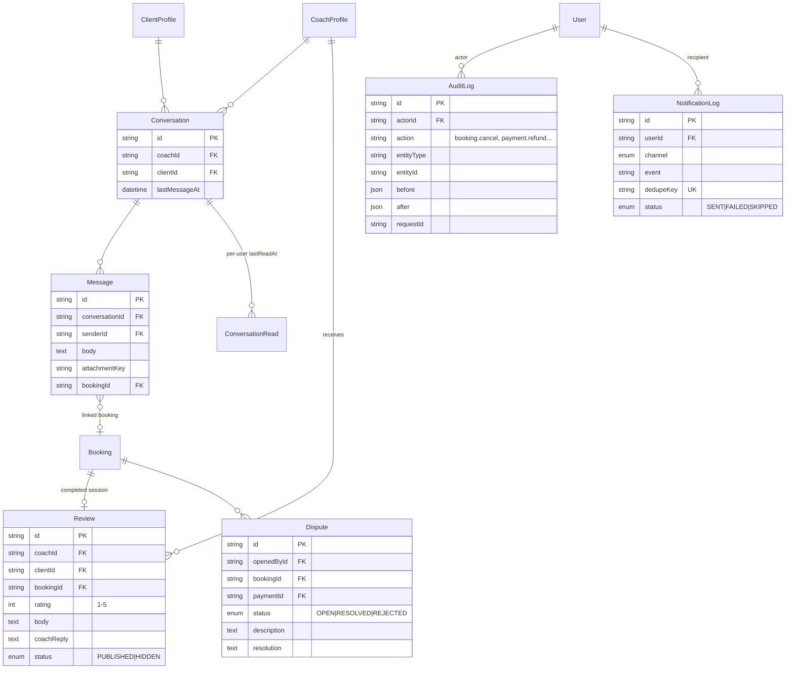

# CoachBook — Implementation Plan

Status: **DRAFT — awaiting approval** (Step 0.1)
Last updated: 2026-10-07

This plan turns the product brief into an architecture, a data model, a folder layout and a phased task list. Section 9 lists the **open questions / proposed decisions** that need your sign-off before Phase 1 starts. Nothing in the brief's "Project Decisions" is changed here; where I had to fill a gap I've marked it **[PROPOSED]** and repeated it in Section 9.

---

## 1. Architecture overview



### 1.1 Layering rules
| Layer | Location | May import | Notes |
|---|---|---|---|
| UI / routes | `src/app`, `src/features/*/components` | `features/*/actions`, `features/*/queries`, `lib` | Never imports `@/server/db` directly (enforced by ESLint `no-restricted-imports`). |
| Server actions & queries | `src/features/*/actions.ts`, `queries.ts` | `server/services`, `server/auth` | Thin: Zod-parse → authenticate → rate-limit → call service. |
| Services | `src/server/services` | `server/domain`, `server/db`, `server/providers`, `server/jobs` | Own transactions, **authorization**, audit logging, enqueueing jobs. |
| Domain | `src/server/domain` | nothing with I/O (only `luxon`, `zod`) | Pure functions; this is where every Section-4 business rule lives and is unit-tested. |
| Providers | `src/server/providers/<kind>` | SDKs | Each kind has an interface + adapters + a `fake` adapter for tests. |

### 1.2 Key technical choices
| Concern | Choice | Why |
|---|---|---|
| Framework | Next.js 16 (App Router), React 19, TypeScript strict | Per brief. |
| Styling | Tailwind CSS v4 + shadcn/ui (Radix) | Per brief; Radix gives accessible primitives (WCAG AA). |
| DB / ORM | PostgreSQL 16 + Prisma 7 (latest **stable**; Prisma 8 is still RC) | Per brief. Things Prisma can't express (exclusion constraints, generated range columns, partial indexes) go in hand-written SQL inside Prisma migrations. |
| Auth | Auth.js v5 (`next-auth@5` — still tagged beta on npm) + Prisma adapter, **database sessions**, email magic link + Google | v5 is the App-Router-native version. DB sessions let admins revoke/suspend instantly. |
| Validation | Zod 4 — one schema per action, shared with forms via `react-hook-form` + `@hookform/resolvers` | Per brief. |
| Time | Luxon (IANA zones, DST-correct arithmetic). All DB timestamps `timestamptz` in UTC. | Mature, small API surface, good DST semantics. |
| Jobs | pg-boss on the same Postgres, separate `worker` process | Per brief; idempotent via `singletonKey` + DB dedupe keys. |
| Realtime | `RealtimeProvider` interface; default = Postgres `LISTEN/NOTIFY` → SSE route; alt = Pusher-protocol (Soketi locally / Pusher in prod) | Per brief. See Q7 about Vercel. |
| Payments | `PaymentProvider` interface; Stripe adapter (test mode); `manual` adapter for cash/bank/e-wallet | Per brief. |
| Video | `VideoProvider`; Jitsi adapter (deterministic unguessable room names); Zoom/Meet stubs | Per brief. |
| Notifications | `NotificationChannel` per channel: email (Resend or SMTP via Nodemailer; Mailpit locally), web push (`web-push` + VAPID), SMS (console/log stub) | Per brief. Templates via React Email. |
| File storage | `StorageProvider`; S3-compatible (MinIO locally, any S3/R2 in prod). Private bucket, short-lived signed URLs | Progress photos & chat images must be private. |
| Charts | Recharts | Progress and earnings charts. |
| Calendar UI | Custom week/day grid (CSS grid) + month view; drag-to-create via pointer events | Off-the-shelf calendars are heavy and hard to make accessible; our needs (buffers/blocks shading, status colors) are specific. |
| PDF receipts | `@react-pdf/renderer` | Server-side receipt PDFs. |
| Logging | `pino` (JSON) with request id; `AuditLog` table for business events | Per brief. |
| Rate limiting | `RateLimiter` interface; default Postgres fixed-window table; optional Upstash adapter | No extra infra by default. |
| Testing | Vitest (unit + integration against a real Postgres), Playwright (E2E), `@axe-core/playwright` for a11y | Per brief. |
| Package manager | pnpm (via corepack), Node 22 LTS | |

### 1.3 How double-booking is prevented (DB level)
We split "time the coach is occupied" from "who is attending":

* **`Appointment`** — one row per occupied coach time slot (1:1 session or a group class). Columns `start_at`, `end_at`, `buffer_before_min`, `buffer_after_min`, plus a **generated** column
  `occupied tstzrange GENERATED ALWAYS AS (tstzrange(start_at - buffer_before, end_at + buffer_after, '[)')) STORED`.
* Raw-SQL migration:
  ```sql
  CREATE EXTENSION IF NOT EXISTS btree_gist;
  ALTER TABLE appointment ADD CONSTRAINT appointment_no_overlap
    EXCLUDE USING gist (coach_id WITH =, occupied WITH &&)
    WHERE (status = 'SCHEDULED');
  ```
* **`Booking`** — one row per client seat in an appointment. Capacity for group sessions is enforced inside a transaction that takes `SELECT … FOR UPDATE` on the appointment row and counts active bookings.
* Booking a new 1:1 slot = insert Appointment + Booking in one transaction; a concurrent insert fails with SQLSTATE `23P01`, which the service maps to a friendly "slot just taken" error. An integration test fires N parallel bookings at one slot and asserts exactly one wins.
* When the last active booking of an appointment is cancelled, the appointment flips to `CANCELLED` and leaves the constraint — the slot becomes bookable again and the waitlist fan-out job is enqueued.
* Time blocks are **not** part of the constraint (coaches may intentionally override their own blocks when booking on behalf of a client); the slot engine excludes them and the booking service re-checks them for client-initiated bookings.

**[PROPOSED] Buffer semantics (Q3):** with a single exclusion constraint, buffers are *additive* — A's after-buffer and B's before-buffer cannot overlap (15 + 15 = 30 min gap). The alternative (`gap ≥ max(afterA, beforeB)`) needs a trigger instead of a constraint.

### 1.4 Slot engine (pure module `src/server/domain/slots`)
```
computeSlots({
  now, coachTz, rangeStartUtc, rangeEndUtc,
  weeklyRules,        // [{weekday, startMinute, endMinute}] in coach-local time
  dateOverrides,      // extra availability on specific local dates
  blocks,             // expanded block intervals (UTC) — recurrence pre-expanded by domain/recurrence
  busy,               // existing SCHEDULED appointments incl. their buffers (UTC)
  openGroupSessions,  // appointments of this service with seats left
  service: { durationMin, bufferBeforeMin, bufferAfterMin, capacity },
  policy:  { minNoticeMin, maxAdvanceDays, slotStepMin },
}) => Slot[]  // { startUtc, endUtc, kind: 'new' | 'join', seatsLeft }
```
Algorithm: build local-day working intervals per date (weekly rules ∪ overrides) → convert each to UTC with Luxon (handles DST gaps/overlaps) → subtract blocks and busy intervals → candidate starts on a `slotStepMin` grid aligned to the working-interval start → keep a candidate only if `[start − bufferBefore, end + bufferAfter)` fits fully inside free time → apply `now + minNotice ≤ start ≤ now + maxAdvance` → merge in joinable group sessions. Interval arithmetic lives in `domain/intervals.ts` (union / subtract / intersect on half-open intervals) with property-based tests (`fast-check`).

Required test cases include: multiple ranges per day, back-to-back sessions, buffers at day edges, blocks partially covering a range, recurring blocks, overrides adding time on a day off, DST spring-forward (non-existent 02:30), DST fall-back (ambiguous 01:30), coach tz ≠ client tz, notice/window boundaries (inclusive/exclusive), group join slots, zero-availability day, Asia/Manila (no DST) and America/New_York / Europe/London (DST).

---

## 2. Domain rules → pure modules (all unit-tested)

| Brief § | Rule | Module |
|---|---|---|
| 4.1 | Working hours − blocks − bookings − buffers; notice/window; DST | `domain/slots`, `domain/intervals`, `domain/recurrence` |
| 4.1 | Buffer resolution (service override ?? coach default) | `domain/buffers` |
| 4.2 | Booking state machine (allowed transitions, who may trigger) | `domain/booking-state` |
| 4.2 | Recurring series expansion & per-occurrence conflicts | `domain/recurrence` |
| 4.3 | Cancellation outcome: inside/outside window × actor × payment method × policy → {status, refund amount, credit action, fee charge, reliability flag} | `domain/cancellation` |
| 4.3 | Reschedule eligibility | `domain/cancellation` |
| 4.4 | Waitlist matching (entry matches freed slot?) | `domain/waitlist` |
| 4.4 | Utilization (booked vs available hours, open slots) | `domain/utilization` |
| 4.5 | Reminder schedule (offsets → fire times, skip past ones) | `domain/reminders` |
| 4.6 | Credit balance, FIFO-by-expiry consumption, return/forfeit, expiry | `domain/credits` |
| 4.6 | Money: platform fee, partial refund, late fee (integer minor units, banker-safe rounding) | `domain/money` |
| 4.6 | Reliability stats (coach late cancels) | `domain/reliability` |
| 4.7 | Review eligibility; rating aggregation | `domain/reviews` |
| 4.8 | PR detection (est. 1RM via Epley, max weight, rep PR at weight), compliance % | `domain/progress` |

### 2.1 Booking state machine
Brief states plus **[PROPOSED]** additions (Q1): `requested`, `declined`, `expired`.



### 2.2 Cancellation outcome table (implemented in `domain/cancellation`)
| Actor | When | Paid by | Status | Client gets | Coach stats |
|---|---|---|---|---|---|
| Client | outside window | credit | `cancelled_by_client` | credit returned | — |
| Client | outside window | card/online | `cancelled_by_client` | full refund via provider | — |
| Client | outside window | offline/unpaid | `cancelled_by_client` | open charge voided; if already paid offline → refund recorded or converted to credit (coach chooses) | — |
| Client | inside window | credit | `late_cancel` | policy `FORFEIT`/`FEE` → credit forfeited; `WAIVE` → credit returned | — |
| Client | inside window | card/online | `late_cancel` | `FORFEIT` → no refund; `FEE x%` → refund (100−x)%; `WAIVE` → full refund | — |
| Client | inside window | offline/unpaid | `late_cancel` | `FORFEIT` → full price stays owed; `FEE x%` → x% stays owed; `WAIVE` → charge voided | — |
| Coach | any | any | `cancelled_by_coach` | full refund / credit returned | if inside window → counted as late coach cancellation |

[PROPOSED] Interpretation of "charge fee %" for credit-paid bookings (Q4): a credit can't be partially forfeited, so `FEE` behaves like `FORFEIT` for credits. Alternative: return the credit and create an x% fee charge.

---

## 3. Data model

Conventions: `cuid2` string ids; `created_at`/`updated_at` everywhere; money as `Int` minor units + ISO-4217 `currency`; times `timestamptz` UTC; local wall-clock rules (availability) stored as `weekday` + minutes-from-midnight in the coach's timezone; soft-delete only where retention requires it (payments, bookings, audit).

Naming note: Auth.js's adapter requires a model called `Session`, so the training session is called **`Appointment`** (occupied time) and a client's seat in it is a **`Booking`**.

### 3.1 Identity, roles & relationships

Auth.js tables (`Account`, `Session`, `VerificationToken`) follow the adapter's schema and are omitted above. A user is a coach if a `CoachProfile` exists, a client if a `ClientProfile` exists, an admin if `isAdmin`. **Every coach↔client data access goes through an `ACTIVE` `CoachClient` row** — that is the ownership boundary for "coaches only see their own clients".

### 3.2 Scheduling & booking


### 3.3 Payments, packages & credits

* Credit balance = `SUM(delta)` per grant where not expired — the ledger is append-only; each mutation carries a unique `idempotencyKey` (e.g. `consume:<bookingId>`), so retries cannot double-spend/double-return.
* "Outstanding balance" = `SUM(Charge.amountMinor WHERE status='OPEN')`.
* `WebhookEvent` has `UNIQUE(provider, eventId)`; handlers run inside the same transaction that marks it processed.
* `PayoutAccount` (coach ↔ Stripe Connect account) and `PlatformSetting` (key/value, e.g. `platformFeeBps = 0`) also live here — see Q5.

### 3.4 Programs, logging & progress

Assigning a template **deep-copies** it into a client-owned `Program` (`copiedFromId` → template) so per-client edits never touch the template.

### 3.5 Communication, marketplace & platform

`Conversation` is `UNIQUE(coachId, clientId)`. `NotificationLog.dedupeKey` (e.g. `reminder:<bookingId>:1440:email`) is what makes reminder jobs idempotent across retries and restarts.

---

## 4. Cross-cutting design

### 4.1 Authorization
* `requireUser()`, `requireCoach()`, `requireAdmin()` in `server/auth`.
* Policy functions in `server/authz/*.ts` — e.g. `assertCanViewClient(actor, clientId)` checks an `ACTIVE` `CoachClient` row or self; `assertOwnsBooking(actor, booking)` allows the booking's client, its coach, or admin.
* Services take an `actor` as first argument and call policies before any read or write; queries for lists are always scoped (`where: { coachId: actor.coachId }`).
* Every service has at least one negative authz test ("coach B cannot read coach A's client").
* Route handlers that aren't user-authenticated (webhooks, iCal, cron) authenticate by signature / secret token / `CRON_SECRET`.

### 4.2 Server action wrapper
```ts
export const cancelBooking = action({
  input: CancelBookingSchema,         // Zod
  rateLimit: 'booking',               // key per user
  handler: (input, { actor }) => bookingService.cancel(actor, input),
});
```
Returns a typed `Result<T, AppError>`; domain errors (`SlotTaken`, `OutsideWindow`, `InsufficientCredits`, `Forbidden`) map to user-friendly messages.

### 4.3 Jobs (pg-boss)
| Job | Trigger | Idempotency |
|---|---|---|
| `booking.reminder` | scheduled at confirm for each offset | `singletonKey=reminder:<booking>:<offset>`; handler re-reads booking (skips if not confirmed / time changed) and uses `NotificationLog.dedupeKey` |
| `booking.hold-expiry` | at `holdExpiresAt` | no-op unless still `pending_payment` |
| `booking.auto-complete` | cron every 15 min | status transition guarded by `WHERE status='confirmed'` |
| `waitlist.fanout` | appointment freed | dedupe per `(appointment slot, client)` |
| `notification.send` | any event | `dedupeKey` |
| `credits.expire` | daily cron | ledger `idempotencyKey=expire:<grant>` |
| `membership.renew-credits` | provider webhook | `idempotencyKey=period:<membership>:<periodStart>` |
| `recurring.extend` | daily cron (if series extend beyond window — Q2) | per occurrence date |

Worker runs as `pnpm worker` (separate process / container). See Q7 for Vercel.

### 4.4 Provider interfaces (sketch)
```ts
interface PaymentProvider {
  id: 'stripe' | 'manual' | string;
  createCheckout(input: CheckoutInput): Promise<{ redirectUrl: string; providerRef: string }>;
  refund(input: { providerRef: string; amountMinor: number; reason: string; idempotencyKey: string }): Promise<RefundResult>;
  createSubscription?(input: SubscriptionInput): Promise<{ redirectUrl: string }>;
  verifyAndParseWebhook(req: Request): Promise<NormalizedPaymentEvent[]>; // throws on bad signature
}
interface VideoProvider { createMeeting(appt: { id: string; startAt: Date; durationMin: number }): Promise<{ url: string }> }
interface NotificationChannel { kind: 'EMAIL' | 'PUSH' | 'SMS'; send(msg: RenderedNotification): Promise<SendResult> }
interface RealtimeProvider { publish(channel: string, event: RealtimeEvent): Promise<void>; /* + client subscribe helper */ }
interface StorageProvider { putSignedUrl(key: string, contentType: string): Promise<string>; getSignedUrl(key: string, ttlSec: number): Promise<string>; delete(key: string): Promise<void> }
```
Business logic only sees `NormalizedPaymentEvent` (`payment.succeeded`, `payment.failed`, `refund.succeeded`, `subscription.renewed`, …), so adding PayMongo/Xendit = one new adapter + registration.

### 4.5 Security & privacy
* Zod on every input; `server-only` import on all server modules; env validated with `@t3-oss/env-nextjs` (no secrets in `NEXT_PUBLIC_*`).
* Rate limits: magic-link requests (per email + per IP), booking create/cancel (per user), chat send, webhook endpoints exempt but signature-verified.
* Progress photos & chat images: private bucket, upload via presigned PUT, view via ≤5-min signed GET after authz check.
* Security headers / CSP via `next.config` + middleware.
* Data export: JSON (+ photos zip) generated by a job, emailed as signed link. Data deletion: see Q9.

### 4.6 Observability
`pino` structured logs with `requestId`, `userId`, `jobId`; `AuditLog` rows written in the **same transaction** as the change for bookings, cancellations, reschedules, payments, refunds, credit adjustments, admin actions.

### 4.7 PWA
Web app manifest, icons, service worker (Serwist) for app-shell caching + web-push handling. Mobile-first layouts; bottom nav on mobile for client; workout logger usable one-handed, works with flaky connection (optimistic local queue of set logs, flushed when online).

---

## 5. Folder structure
```
.
├── CLAUDE.md
├── README.md
├── docker-compose.yml          # postgres:16, mailpit, minio (+ soketi profile)
├── Dockerfile                  # web + worker images
├── .env.example
├── docs/
│   ├── PLAN.md
│   ├── decisions/              # ADRs (one file per decision)
│   └── demo/phase-N.md         # manual verification scripts per phase
├── prisma/
│   ├── schema.prisma
│   ├── migrations/             # includes hand-written SQL (btree_gist, exclusion, generated cols)
│   └── seed/                   # index.ts + fixtures (exercises.json, coaches, clients…)
├── public/                     # icons, manifest assets
├── src/
│   ├── app/
│   │   ├── (public)/           # landing, /coaches (search), /c/[slug] (profile), /c/[slug]/book
│   │   ├── (auth)/             # /sign-in, /verify, /invite/[token]
│   │   ├── coach/              # dashboard, calendar, availability, services, clients/[id],
│   │   │                       # programs, exercises, payments, packages, messages, settings
│   │   ├── me/                 # client: bookings, book, packages, programs, workouts/[id]/log,
│   │   │                       # progress, messages, settings, data-export
│   │   ├── admin/              # users, listings, reviews, disputes, settings, audit
│   │   ├── api/
│   │   │   ├── auth/[...nextauth]/
│   │   │   ├── webhooks/[provider]/
│   │   │   ├── ical/[token]/
│   │   │   ├── realtime/       # SSE stream
│   │   │   └── cron/[job]/     # protected by CRON_SECRET (Vercel Cron fallback)
│   │   ├── manifest.ts
│   │   └── layout.tsx
│   ├── components/
│   │   ├── ui/                 # shadcn generated
│   │   └── shared/             # app-level reusable (TimeRangeInput, MoneyInput, EmptyState…)
│   ├── features/               # per-domain UI + actions + queries
│   │   ├── availability/  booking/  calendar/  clients/  payments/  programs/
│   │   ├── logging/  progress/  chat/  marketplace/  notifications/  admin/
│   │   └── <feature>/{components/, actions.ts, queries.ts, schemas.ts}
│   ├── server/
│   │   ├── db.ts  env.ts  logger.ts  audit.ts  rate-limit.ts  errors.ts  action.ts
│   │   ├── auth/               # Auth.js config, requireUser/Coach/Admin
│   │   ├── authz/              # policy functions
│   │   ├── domain/             # PURE business rules (+ *.test.ts colocated)
│   │   ├── services/           # use-cases (+ *.int.test.ts)
│   │   ├── providers/
│   │   │   ├── payment/{types.ts, stripe.ts, manual.ts, fake.ts, index.ts}
│   │   │   ├── video/{types.ts, jitsi.ts, zoom.stub.ts, meet.stub.ts}
│   │   │   ├── notification/{email-resend.ts, email-smtp.ts, push.ts, sms-log.ts, templates/}
│   │   │   ├── realtime/{pg-sse.ts, pusher.ts}
│   │   │   └── storage/{s3.ts, fake.ts}
│   │   └── jobs/               # queue setup, job names, handlers
│   ├── worker/index.ts         # pg-boss worker entrypoint
│   └── lib/                    # client-safe: money format, time format, cn(), constants
├── tests/
│   ├── integration/setup.ts    # migrate test DB, truncate between tests
│   ├── factories/              # typed builders for test data
│   └── e2e/                    # Playwright specs + fixtures
├── vitest.config.ts  vitest.workspace.ts
├── playwright.config.ts
├── eslint.config.mjs  prettier.config.mjs  tsconfig.json
└── package.json
```
Unit tests are colocated (`*.test.ts`); integration tests use `*.int.test.ts` and run against a dedicated `coachbook_test` database.

---

## 6. Phase-by-phase task list

Every phase ends with: `pnpm db:migrate` clean on an empty DB → `pnpm db:seed` → `pnpm lint` → `pnpm typecheck` → `pnpm test` (unit + integration) → README updated → `docs/demo/phase-N.md` written → summary + STOP for review.

### Phase 1 — Foundation
1. Scaffold Next.js 16 + TS strict, Tailwind v4, shadcn/ui init, ESLint (flat) + Prettier, path aliases, `server-only`.
2. `docker-compose.yml`: Postgres 16 (+ `coachbook_test` DB), Mailpit, MinIO (+ bucket bootstrap).
3. Env schema (`server/env.ts`), `.env.example`, pino logger, error types, `action()` wrapper, `Result` type.
4. Prisma schema for **all** models in Section 3 (so later phases add behavior, not churn); first migration incl. `btree_gist`, generated `occupied` column, exclusion constraint, partial/unique indexes.
5. Auth.js v5: email magic link (Mailpit locally) + Google; DB sessions; sign-in/verify pages; suspended-user guard.
6. Roles & onboarding: "I'm a coach / I'm a client / both" flow creating profiles; admin flag via seed/env allowlist.
7. Authz helpers + policy module skeleton + negative tests.
8. Coach profile edit (incl. timezone, currency, policies placeholders), client profile edit; coach invite links (`CoachClient` INVITED → ACTIVE on acceptance).
9. App shells: coach / client / admin layouts, mobile nav, role switcher for dual-role users.
10. Audit log helper; rate limiter (Postgres) on magic-link requests.
11. Vitest config (unit + integration projects), test DB setup/teardown, factories.
12. Seed: 1 admin, 3 coaches (different timezones/currencies incl. Asia/Manila PHP), 10 clients, coach-client links, global exercise library (~80 exercises), specialties. (Bookings/packages/programs seeded in the phase that builds them, but the seed script is structured so the final seed matches the brief.)
13. README: setup, env vars, commands. Optional: GitHub Actions CI running lint/typecheck/tests with a Postgres service.

### Phase 2 — Scheduling core
1. `domain/intervals` (+ property tests), `domain/recurrence` (RRULE subset: WEEKLY with BYDAY, COUNT/UNTIL; EXDATE), `domain/buffers`.
2. `domain/slots` — full slot engine + the test matrix in §1.4.
3. Services CRUD (duration, location type, price, capacity, buffer overrides, color).
4. Availability editor: weekly multi-range per day, date overrides, time blocks (single + recurring) — mobile-friendly.
5. Coach scheduling settings: default buffers, min notice, max advance, slot step, approval-required toggle.
6. Booking service: create (1:1 and group join) in a transaction; map `23P01` → `SlotTaken`; capacity check with row lock; block re-check for client bookings. Concurrency integration test.
7. Client booking flow: coach → service → date strip → slots (rendered in client tz, coach tz shown) → confirm. In Phase 2 payment = "pay later" (OFFLINE) so the flow is usable; Phase 4 adds online payment & credits.
8. Coach books on behalf of a client; booking requests (approval mode) with approve/decline.
9. Recurring bookings: series creation, preview with per-occurrence conflict report, per-occurrence cancel.
10. Booking state machine module + transitions (complete, no-show).
11. Coach calendar: day/week/month, status colors, buffer & block shading, drag to create block, click to view/edit; client "My bookings" list.
12. iCal feed `/api/ical/[token]` + token rotate.
13. Seed: services, availability, blocks, a realistic week of bookings (incl. one group class, one recurring series).

### Phase 3 — Policies & notifications
1. `domain/cancellation` + full outcome table tests; `domain/reliability`.
2. Cancel flow (reason required) for client and coach; reschedule = cancel + rebook in one transaction (both or neither).
3. Coach policy settings UI (window, late-cancel policy, fee %), shown to clients before booking/cancelling.
4. pg-boss setup, worker entrypoint, job registry; `pnpm worker`; graceful shutdown.
5. Notification core: event → template (React Email) → per-user preferences → channels; `NotificationLog` dedupe.
6. Channels: email (SMTP/Mailpit + Resend), web push (VAPID, service worker, subscribe UI), SMS log stub.
7. Reminders (configurable offsets), hold-expiry, auto-complete jobs.
8. Waitlist: join from a full day; `waitlist.fanout` on freed slots to waitlist + opted-in clients; first-come booking via the normal (constraint-protected) path.
9. Coach dashboard: utilization (booked vs available hours), open slots list, "share open slots" (copyable text + public link).
10. Notification preferences page; reliability stats on coach dashboard/admin.

### Phase 4 — Payments / POS
1. `domain/money`, `domain/credits` (+ tests: FIFO by expiry, eligibility by service, expiry, return/forfeit idempotency).
2. Package & membership plan CRUD; client purchase flows.
3. `PaymentProvider` interface, Stripe adapter (Checkout, refunds, subscriptions, Connect per Q5), `manual` adapter, `fake` adapter for tests.
4. Webhook route: signature verification, `WebhookEvent` dedupe, normalized event handling; integration tests with signed fixture payloads + replay test.
5. Booking ↔ payment: pay online (→ `pending_payment` hold), pay with credit (consume), pay later (open `Charge`); cancellation outcomes wired to refunds/credit returns/fees.
6. Offline payment recording (cash, bank transfer, e-wallet + reference no.), settle open charges.
7. Refunds (full/partial) via provider; receipts (PDF + email) with per-coach numbering.
8. Earnings dashboard: revenue by period, outstanding balances, upcoming payouts, platform fee setting (admin, default 0%).
9. Seed: packages, a membership plan, purchases, mix of paid/unpaid bookings.

### Phase 5 — Programs & progress
1. Exercise library (global + coach custom), search/filter.
2. Program builder: weeks → workouts → exercise entries; reorder, duplicate week/day, supersets; save as template.
3. Assign (deep-copy) to clients; per-client edit; client "today's workout" view.
4. Mobile workout logger: per-set checkboxes, actual reps/weight/RPE, rest timer, notes, offline-tolerant queue.
5. `domain/progress`: PR detection, compliance %; PR badges.
6. Body metrics + progress photos (private storage, signed URLs, share-with-coach toggle); charts.
7. Coach client view: compliance, latest logs, comment on a logged workout; session notes on completed bookings.
8. Seed: program template assigned to several clients with some logs and metrics.

### Phase 6 — Communication
1. `RealtimeProvider` (pg LISTEN/NOTIFY + SSE; Pusher adapter).
2. Conversations, messages (text + image), unread counts, link message to booking, new-message notification (debounced).
3. `VideoProvider` (Jitsi; Zoom/Meet stubs); auto-create link for online appointments; show in booking details, reminders and iCal.

### Phase 7 — Marketplace
1. Public coach profile page (SSR, OG tags), services & prices, availability preview, reviews.
2. Search/filter: specialty, city/area, online vs in-person, price range, has availability in next 7 days (precomputed nightly + on change), rating; pagination.
3. Reviews (eligibility rule, one per client-coach — Q8, coach reply, admin hide).
4. Visibility toggle; private coaches reachable via invite link only.
5. Admin: users (suspend, roles), listings moderation, reviews, disputes, platform settings, audit log viewer.

### Phase 8 — Hardening
1. Playwright E2E: (a) client books → pays (Stripe test / fake provider) → reminder job fires (time-travelled) → cancels → refund/credit; (b) coach books on behalf + offline payment; (c) recurring + per-occurrence cancel; (d) workout logging on mobile viewport.
2. Accessibility pass: axe on key pages, keyboard nav for calendar & logger, contrast, focus states.
3. Performance: bundle analysis, RSC streaming, indexes review (`EXPLAIN` on slot/search queries), image optimization, Lighthouse mobile ≥ 90 target.
4. Security review: authz test sweep, rate limits, headers/CSP, dependency audit.
5. Client data export & deletion flows (if not done earlier).
6. Deployment docs: Docker Compose prod profile; Vercel + managed Postgres + worker host; env var reference; backup notes.

---

## 7. Testing strategy
| Level | Tool | Scope |
|---|---|---|
| Unit | Vitest (+ fast-check) | Everything in `server/domain` — required for every Section-4 rule; target ≥ 95% line coverage for `domain/`. |
| Integration | Vitest against real Postgres (`coachbook_test`) | Services: booking concurrency/exclusion constraint, cancellation→refund/credit, webhooks idempotency, authz negatives, jobs idempotency. Providers replaced by `fake` adapters; time controlled via an injected `Clock`. |
| E2E | Playwright (+ axe) | The 4 flows in Phase 8, run against docker-compose stack with seeded data. |

A `Clock` interface (`now()`) is injected into services and job handlers so tests can time-travel deterministically.

## 8. Commands (target)
```
pnpm dev            # next dev
pnpm worker         # pg-boss worker (tsx watch in dev)
pnpm db:up          # docker compose up -d
pnpm db:migrate     # prisma migrate dev
pnpm db:seed        # prisma db seed
pnpm db:reset       # reset + seed
pnpm lint           # eslint
pnpm typecheck      # tsc --noEmit
pnpm test           # vitest run (unit + integration)
pnpm test:unit
pnpm test:int
pnpm test:e2e       # playwright
pnpm build
```

---

## 9. Open questions & proposed decisions (please confirm or edit)

Each has a recommended default; replying "approve defaults" accepts all of them.

| # | Topic | Question / conflict | Recommended default |
|---|---|---|---|
| Q1 | Booking states | The brief's 7 states don't cover approval-mode requests or unpaid holds that time out. | Add `requested`, `declined`, `expired` to the 7 listed states. |
| Q2 | Recurring vs. max advance window | "Every MWF for 8 weeks" exceeds a 30-day advance window. | Recurring series ignore `maxAdvanceDays` (but still respect min notice). Occurrences that conflict are **skipped and reported**, not fail-all. All occurrences are created up front. |
| Q3 | Buffer stacking | Should A's after-buffer and B's before-buffer be allowed to overlap? | No (additive) — enforceable by a pure exclusion constraint. Alternative needs a trigger. |
| Q4 | "Charge fee %" for credit-paid late cancels | Can't forfeit part of a credit. | `FEE` forfeits the credit (same as `FORFEIT`). For card-paid → partial refund; for unpaid → x% charge stays owed. |
| Q5 | Money flow / payouts | Is CoachBook the merchant collecting for coaches ("upcoming payouts", platform fee) or does each coach use their own Stripe? | **Stripe Connect Express** with destination charges + `application_fee_amount` (platform fee, default 0). Coach onboarding to Connect is required to accept online payments; offline payments work without it. |
| Q6 | Pay-later bookings | Can clients book without paying (cash on the day), or only coach-created bookings? | Per-coach setting `allowPayLater` (default **on**, since most target coaches take cash/GCash today). Pay-later bookings are `confirmed` with an open `Charge`. Coach-created bookings always allow it. |
| Q7 | Vercel limitations | Vercel can't run a long-lived pg-boss worker, and SSE functions have duration limits. | Docker deploy: worker container + SSE. Vercel deploy: worker runs on a small separate host (Railway/Fly/Render) **or** Vercel Cron hits `/api/cron/[job]` to drain due jobs each minute; realtime uses the Pusher adapter. I'll document both. |
| Q8 | Reviews | One review per completed booking, or one per client-coach pair? | One per client-coach pair (editable, latest completed booking linked). Prevents rating-spam by frequent clients. |
| Q9 | Data deletion vs. financial records | Deleting a client vs. keeping payment/booking history for the coach's books. | Hard-delete personal content (photos, logs, metrics, messages, profile); anonymize bookings/payments/audit rows ("Deleted client") and keep them. 7-day grace period before purge. |
| Q10 | Memberships | What does a monthly membership grant? | `creditsPerPeriod` (N session credits per month, unused expire at period end) or unlimited (`null`) for eligible services. Billed via Stripe subscriptions; offline renewals recorded manually. |
| Q11 | Slot granularity | Slot start interval isn't specified. | Per-coach `slotStepMin`, default 30 (options 15/30/60). |
| Q12 | Location search | Radius/geo search or area-based? | Area/city-based filter for MVP (text + predefined city list per country); PostGIS radius search deferred. |
| Q13 | Payment hold | How long is a slot held while paying online? | 15 minutes (`pending_payment` → `expired`). |
| Q14 | Auth.js version | Auth.js v5 is still published under the `beta` tag. | Use v5 (pinned exact version); it's the App Router–native API. Fallback would be v4 or Better Auth — not recommended. |
| Q15 | Group sessions & waitlists | Waitlists for full group classes? | Yes — same `WaitlistEntry` mechanism, matched by service + time. |
| Q16 | Default currency/locale for seed | Target market looks Philippines-first (PayMongo/GCash mention). | Seed coaches: 2 × Asia/Manila PHP, 1 × America/New_York USD (to exercise DST). UI copy English. |
